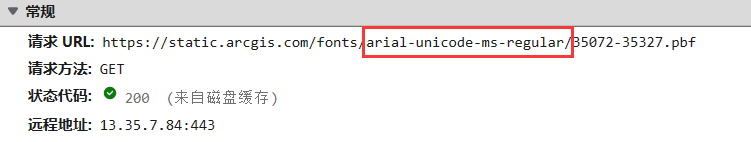
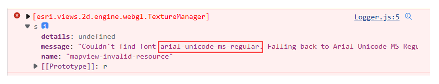

# download-arcgis-font


将 arcgis-font 提供的在线字体文件下载至本地的工具。

arcgis js 默认会从 arcgis 在线服务获取字体文件，但由于网络、环境等问题影响，某些项目不能正常的引用在线的 arcgis 字体，这个工具会将指定的 arcgis font 在线下载至本地，以便于项目直接本地引用。

## 安装

需求：`node 12+`

```shell
npm install -g download-arcgis-font
```

## 如何使用

**第一步：获取在线字体名称**

在浏览器开发者工具网络面板中找到要下载的在线字体链接，一般以 .pbf 结尾，复制其中的 **字体名称**：



或者在报错信息中复制未找到的字体名称：



**第二步：下载字体文件**

找一个空文件夹，并执行如下命令：

```bash
download-arcgis-font 字体名称
# 例如 download-arcgis-font arial-unicode-ms-bold
# 或者 download-arcgis-font https://static.arcgis.com/fonts/arial-unicode-ms-bold
```

回车后工具将会打印如下输出：

```
downloading font source 256
download complate, save to D:\download-arcgis-font\result\arial-unicode-ms-bold
```

然后你就可以在日志最后一行的文件夹中找到下载好的字体文件夹了，目录如下：

```
result
└── arial-unicode-ms-bold
    └── 0-255.pbf ...
```

## 在项目中引用

使用方式非常简单，首先将下载好的字体文件复制进前端项目的 `/public` 中（或者其他的静态资源托管服务）。

然后使用 esriConfig 配置字体路径即可：


```js
// ADM
require(["esri/config"], (esriConfig) => {
    esriConfig.fontsUrl = 'http://your-local-fonts-url';
});
```

```js
// ESM
import esriConfig from '@arcgis/core/config';
esriConfig.fontsUrl = 'http://your-local-fonts-url';
```

## 命令行参数及配置项

你可以随时使用 `--help` 参数查看帮助信息。

- **参数 `font-name`**

    工具只接受一个参数，即 arcgis fonts 的在线字体名称。例如：`arial-unicode-ms-bold`。
    
    工具会自动去官方 arcgis 在线字体服务中下载对应的字体文件。

    如果你想去指定站点下载文件的话，可以直接传入在线字体链接即可，例如：`https://static.arcgis.com/fonts/arial-unicode-ms-bold`，注意不要包含后面的 pbf 文件名。

- **配置项 `-d, --dist <savePath>`**

    字体文件要下载到的位置，默认为 `./result`。

- **配置项 ` -c, --concurrent <number>`**

    下载字体源文件时的并发数量，默认为 10。

## 参考

本工具使用如下依赖开发:
[fs-extra](https://github.com/jprichardson/node-fs-extra)
[chalk](note.youdao.com/web/#/file/B32A092E6C2E45DDB3CED7097A92057C/markdown/9E130E1FE7374FAC8579C1CC0B85B96E/)
[node-fetch](https://www.npmjs.com/package/node-fetch)。